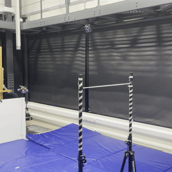
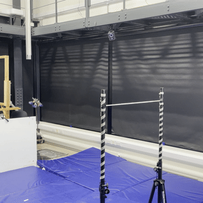

# Learning Agile Tensile Perching for Aerial Robots from Demonstrations

**This repo is only for display of experimental result. To read the code and installation instruction please go to [Aerial Robotics Group](https://github.com/AerialRoboticsGroup/agile-tethered-perching.git).**

## Results

Here is an example of a <strong>full perching trajectory</strong> controlled by a human operator, sped up by a factor of <strong>10</strong>. It is evident that the human operator employs a more conservative perching strategy, with relatively longer waiting times.

   

### Hardware Experiment

The benchmark condition: the last one-third of the tether hitting the branch. This ensured that each strategy operated under equal conditions.

| **Agent**            | **SACfD - 2 Demos**                                                         | **SACfD - 5 Demos**                                                         | **SACfD - 6 Demos**                                                         | **SAC - 0 Demos**                                                         |
|----------------------|----------------------------------------------------------------------------|----------------------------------------------------------------------------|----------------------------------------------------------------------------|----------------------------------------------------------------------------|
| **Traj A**            |  |  |  |  |
| **Traj B**            |  |  |  |  |
| **Observed Strategy** | Achieves wrapping by making frequent, jerky pitch adjustments that cause oscillations in the tether, but the horizontal circling motion and lack of strong upward intention increase the risk of payload contact with the drone. | Employs fewer, smoother pitch adjustments with a stronger upward motion after wrapping, ensuring consistent tether tension and avoiding payload contact. | A single upward pitch and quick ascent after initial contact, maintaining continuous tension and avoiding payload contact, followed by a slight backward movement for efficient tightening. | Flies over the branch and targets a point higher and on the opposite side of the branch to promote wrapping. |

#### Payload Shape Effects

Smaller size and smooth shape can reduce the likelihood of the payload hitting the tether, which can lead to failed wrapping or fewer wraps.

| **Minimal Payload** | **Bigger Payload** |
|--------------------|---------------------|
|  | |
| Success Rate: 5/5 |Success Rate: 4/5, the payload hitting the tether interrupts the wrapping|

#### Payload Mass Effects
A lighter payload facilitates easier execution of the wrapping maneuver. As the payload mass increases, the drone requires greater thrust, torque, or velocity to reach the designated position. This, however, often leads to overshooting the target location.

<table>
  <tr>
    <th rowspan="2">10 grams</th>
    <th rowspan="2">20 grams</th>
    <th colspan="2">30 grams</th>
  </tr>
  <tr>
    <th>Unwrapped</th>
    <th>Wrapped</th>
  </tr>
  <tr>
    <td></td>
    <td></td>
    <td></td>
    <td></td>
  </tr>
  <tr>
    <td>Successful - Last 1/3 Tether Contacts the Branch</td>
    <td>Too High</td>
    <td>Too High</td>
    <td>Too High & Payload Mass Balanced Drone Mass</td>
  </tr>
  <tr>
    <td>Success Rate: 3/3</td>
    <td>Success Rate: 0/3</td>
    <td colspan="2">Success Rate: 1/3</td>
  </tr>
</table>

#### Velocity Effects

As the execution time increases, the speed decreases, resulting in a lower control frequency. When the speed is too high (corresponding to a frequency above 20 Hz), the approach angle of the tether to the branch becomes nearly horizontal, which is suboptimal for wrapping. Conversely, when the speed is too low (below 16.7 Hz), the tetherand payload lack the necessary momentum to achieve effective wrapping.

<table border="1" cellpadding="8" cellspacing="0" style="text-align:center; border-collapse:collapse; width:100%;">
  <thead>
    <tr>
      <th rowspan="2">0.6 seconds</th>
      <th colspan="2">0.8 seconds</th>
      <th rowspan="2">1 second - Default</th>
      <th rowspan="2">1.2 seconds</th>
      <th rowspan="2">1.4 seconds</th>
    </tr>
    <tr>
      <th>Fail</th>
      <th>Success</th>
    </tr>
  </thead>
  <tbody>
    <tr>
      <td></td>
      <td></td>
      <td></td>
      <td></td>
      <td colspan="2">No Video but Rosbag Recorded</td>
    </tr>
    <tr>
      <td>Success Rate: 0/1 - Too high, tether over horizontal to the ground</td>
      <td colspan="2">Success Rate: 1/3 - Payload Hit Tether, tether over horizontal to the ground </td>
      <td>Success Rate: 3/3 </td>
      <td>Success Rate: 3/3 </td>
      <td>Success Rate: 0/3 - Not enough velocity</td>
    </tr>
  </tbody>
</table>

### Simulation Testing

The performance in both simulation and experiment is consistent, demonstrating the same subtle control techniques and trajectory shapes. The only discrepancy is with the SAC agent, which failed to achieve wrapping in simulation due to slow velocity, but achieved 100% success in real-world experiments. This is reasonable because the simulation represents a worst-case scenario where the system is significantly lighter—approximately 10 times smaller in overall mass—compared to the tethered drone system used in real-world experiments.

| **Agent**            | **SACfD - 2 Demos**                                                         | **SACfD - 5 Demos**                                                         | **SACfD - 6 Demos**                                                         | **SAC - 0 Demos**                                                         |
|----------------------|----------------------------------------------------------------------------|----------------------------------------------------------------------------|----------------------------------------------------------------------------|----------------------------------------------------------------------------|
| **Traj A**            |  |  |  |  |
| **Traj B**            |  |  |  |  |

## Most Effective Strategy
This strategy was chosen based on an analysis of its smoothness, agility, and control techniques, as well as human observation. Unlike SAC, which aggressively flies over the branch to encourage wrapping, or other SACfD strategies that either exert excessive upward force to tighten the wrapping or make abrupt up-down pitch adjustments to swing the tether, this strategy involves a single upward pitch followed by a quick ascent. It then smoothly switches back to tighten the tether, while also avoiding payload collisions. The whole trajectory balances the agility and smoothness, invovling subtle control technique with deliberate control intention.

| **Normal Speed**                                                                                                                             | **Slow Motion**                                                                                                                             | **Corresponding Simulation**                                                                                                                        |
|-------------------------|--------------------------------------------------------------------------------------------------------------------------------------------|--------------------------------------------------------------------------------------------------------------------------------------------|
|   |                                      |                                                                                       |
                                             
