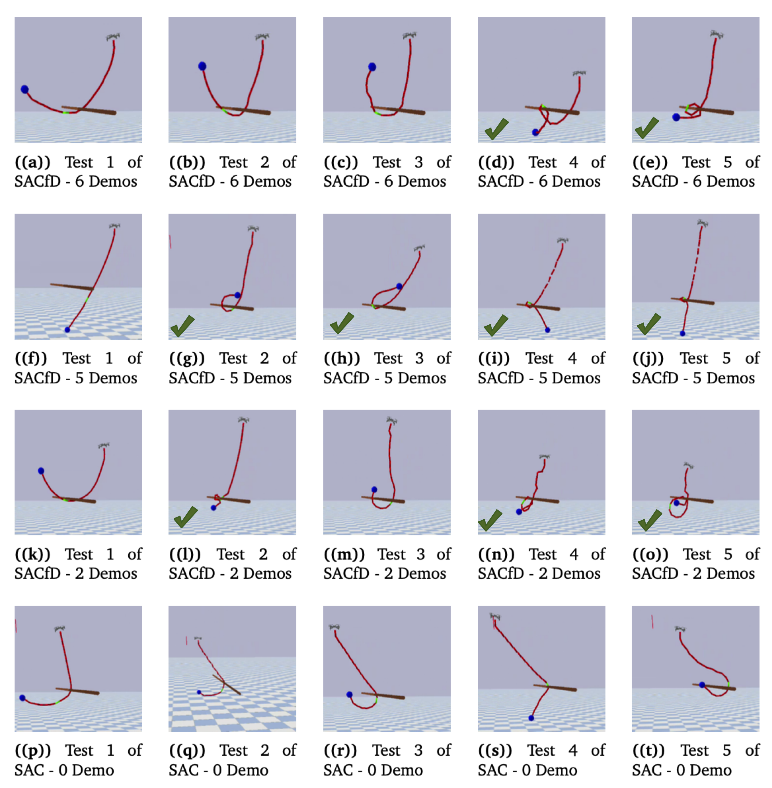

# Learning Tethered Drone Agile Perching Strategy

This project learns an agile tethered drone perching strategy using reinforcement learning (RL) - SAC Learning from Demonstration (SACfD) technique. A detailed PyBullet simulation environment, integrating a PID controller and realistic drone dynamics was developed to model the complex interactions between the drone, tether, and payload.


the drone model is a MAV model inheritrd from ['gym_pybullet_drones project'](https://github.com/utiasDSL/gym-pybullet-drones) with its compatiable pid controller developed by them. the mav model is approxiamte 1:10 mass ratio to the custimised drone used to test in real-world expreiments. The RL learning algorithm ustilized RL library ['Stable-Baseline3'](https://github.com/DLR-RM/stable-baselines3). 


This is a minimalist refactoring of the original `gym-pybullet-drones` repository, designed for compatibility with [`gymnasium`](https://github.com/Farama-Foundation/Gymnasium), [`stable-baselines3` 2.0](https://github.com/DLR-RM/stable-baselines3/pull/1327), and SITL [`betaflight`](https://github.com/betaflight/betaflight)/[`crazyflie-firmware`](https://github.com/bitcraze/crazyflie-firmware/).

> **NOTE**: if you prefer to access the original codebase, presented at IROS in 2021, please `git checkout [paper|master]` after cloning the repo, and refer to the corresponding `README.md`'s.

 

## Installation

Tested on Intel x64/Ubuntu 22.04 and Apple Silicon/macOS 14.1.

```sh
git clone https://github.com/utiasDSL/gym-pybullet-drones.git
cd gym-pybullet-drones/

conda create -n drones python=3.10
conda activate drones

pip3 install --upgrade pip
pip3 install -e . # if needed, `sudo apt install build-essential` to install `gcc` and build `pybullet`

```

## Use

## Results

### Simulation Testing
 


The main reasons for failed wrapping attempts in the simulation testing were either due to slow velocity, the payload losing momentum during wrapping, or the payload hitting the tether during wrapping.

Overall, the success rate of the SACfD agent in simulation is 60%, while the success rate in real-world experiments is 100%. The discrepancy between simulation and experiment is reasonable due to the extra lightweight design used in the simulation. If the exact same trajectory were executed in real-world experiments, the simulated failed trajectories during testing would likely be a successful strategy.


## References

- Jacopo Panerati and Hehui Zheng and SiQi Zhou and James Xu and Amanda Prorok and Angela P. Schoellig (2021) [*Learning to Fly---a Gym Environment with PyBullet Physics for Reinforcement Learning of Multi-agent Quadcopter Control*](https://arxiv.org/abs/2103.02142) 
- Antonin Raffin, Ashley Hill, Maximilian Ernestus, Adam Gleave, Anssi Kanervisto, and Noah Dormann (2019) [*Stable Baselines3*](https://github.com/DLR-RM/stable-baselines3)

## Future Work

- [ ] Add motor delay, advanced ESC modeling by implementing a buffer in `BaseAviary._dynamics()`
- [ ] Replace `rpy` with quaternions (and `ang_vel` with body rates) by editing `BaseAviary._updateAndStoreKinematicInformation()`, `BaseAviary._getDroneStateVector()`, and the `.computeObs()` methods of relevant subclasses

## Troubleshooting

- On Ubuntu, with an NVIDIA card, if you receive a "Failed to create and OpenGL context" message, launch `nvidia-settings` and under "PRIME Profiles" select "NVIDIA (Performance Mode)", reboot and try again.

Run all tests from the top folder with

```sh
pytest tests/
```
- If the same issue above happens in Conda, please edit .bashrc with 
