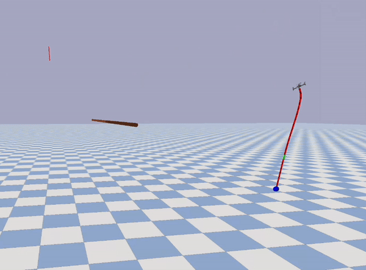

# Learning Tethered Drone Agile Perching Strategy

This project focuses on developing an **agile** perching **strategy** for tethered drones using reinforcement learning (RL), specifically the SAC Learning from Demonstration (SACfD) technique. The RL algorithm utilized the ['Stable-Baselines3'](https://github.com/DLR-RM/stable-baselines3) library.

A complete tethered drone system (drone-tether-payload) was simulated, incorporating realistic drone dynamics, a PID controller, and a tether-payload system to model the perching process. The drone model used is a MAV model inherited from the ['gym_pybullet_drones'](https://github.com/utiasDSL/gym-pybullet-drones) project, with its compatible PID controller developed by the same team. The simulated MAV has an approximate 1:10 mass ratio, compared to the customized drone used in real-world experiments. 

The learned perching strategy demonstrated precise control, utilizing the drone’s dynamics, such as pitch angle and tether tension, to securely wrap the tether around the branch, executing smooth and efficient perching maneuvers. This was validated through real-world experiments at the Imperial College London Aerial Robotics Lab, where a **100%** success rate on selected trajactories was achieved across 52 runs, with perching completed in under 1 second — an 18.48% improvement over previous work. The SACfD agents consistently performed well on selected trajectories in both setups (20 runs in simulation and 42 runs in experiments). The actual conducted experiments including unrecored ones are up to 150 runs.

Learning from diverse (imperfect) demonstrations is proved valuable, as the SACfD agents successfully executed perching maneuvers across all test runs on selected trajectories, demonstrating smoothness, agility, and control.

The findings emphasize the importance of accurate simulation environments for transferring RL-trained behaviors to real-world applications.

## Installation

Tested on Ubuntu 22.04

```
git clone https://github.com/kyrran/gym-pybullet-drones
cd gym-pybullet-drones/

conda create -n drones python=3.10
conda activate drones

pip3 install --upgrade pip
pip3 install -e . # if needed, `sudo apt install build-essential` to install `gcc` and build `pybullet`

```
## Main Training Script

This script handles training, evaluation (saving the best model), and testing. The training time can be adjusted by changing the `1200000` timestep parameter to fit different training goals. For example, this project shows results after 1.2 million timesteps. 

The `--show-demo` flag controls whether to display the training GUI. It is generally not recommended as it significantly reduces the training speed. Training for 1.2M timesteps usually takes around 3-4 hours, while 120k timesteps take approximately 25-30 minutes.

```
cd gym-pybullet-drones/examples/
python main.py -t 1200000 --algo SACfD --show-demo
```

**Training System Architecture for SACfD Agent**


## Results

Here is an example of a <strong>full perching trajectory</strong> controlled by a human operator, sped up by a factor of <strong>10</strong>. It is evident that the human operator employs a more conservative perching strategy, with relatively longer waiting times.

   


### Hardware Experiment

The benchmark condition: the last one-third of the tether hitting the branch. This ensured that each strategy operated under equal conditions.

| **Agent**            | **SACfD - 2 Demos**                                                         | **SACfD - 5 Demos**                                                         | **SACfD - 6 Demos**                                                         | **SAC - 0 Demos**                                                         |
|----------------------|----------------------------------------------------------------------------|----------------------------------------------------------------------------|----------------------------------------------------------------------------|----------------------------------------------------------------------------|
| **Traj A**            |  |  |  |  |
| **Traj B**            |  |  |  |  |
| **Observed Strategy** | Achieves wrapping by making frequent, jerky pitch adjustments that cause oscillations in the tether, but the horizontal circling motion and lack of strong upward intention increase the risk of payload contact with the drone. | Employs fewer, smoother pitch adjustments with a stronger upward motion after wrapping, ensuring consistent tether tension and avoiding payload contact. | A single upward pitch and quick ascent after initial contact, maintaining continuous tension and avoiding payload contact, followed by a slight backward movement for efficient tightening. | Flies over the branch and targets a point higher and on the opposite side of the branch to promote wrapping. |

## Payload Shape Effects

Smaller size and smooth shape can reduce the likelihood of the payload hitting the tether, which can lead to failed wrapping or fewer wraps.

| **Minimal Payload** | **Bigger Payload** |
|--------------------|---------------------|
|  | |
| Success Rate: 5/5 |Success Rate: 4/5, the payload hitting the tether interrupts the wrapping|


## Payload Mass Effects
A lighter payload facilitates easier execution of the wrapping maneuver. As the payload mass increases, the drone requires greater thrust, torque, or velocity to reach the designated position. This, however, often leads to overshooting the target location.

<table>
  <tr>
    <th rowspan="2">10 grams</th>
    <th rowspan="2">20 grams</th>
    <th colspan="2">30 grams</th>
  </tr>
  <tr>
    <th>Unwrapped</th>
    <th>Wrapped</th>
  </tr>
  <tr>
    <td></td>
    <td></td>
    <td></td>
    <td></td>
  </tr>
  <tr>
    <td>Successful - Last 1/3 Tether Contacts the Branch</td>
    <td>Too High</td>
    <td>Too High</td>
    <td>Too High & Payload Mass Balanced Drone Mass</td>
  </tr>
  <tr>
    <td>Success Rate: 3/3</td>
    <td>Success Rate: 0/3</td>
    <td colspan="2">Success Rate: 1/3</td>
  </tr>
</table>

## Velocity Effects

As the execution time increases, the speed decreases, resulting in a lower control frequency. When the speed is too high (corresponding to a frequency above 20 Hz), the approach angle of the tether to the branch becomes nearly horizontal, which is suboptimal for wrapping. Conversely, when the speed is too low (below 16.7 Hz), the tetherand payload lack the necessary momentum to achieve effective wrapping.

<table border="1" cellpadding="8" cellspacing="0" style="text-align:center; border-collapse:collapse; width:100%;">
  <thead>
    <tr>
      <th rowspan="2">0.6 seconds</th>
      <th colspan="2">0.8 seconds</th>
      <th rowspan="2">1 second - Default</th>
      <th rowspan="2">1.2 seconds</th>
      <th rowspan="2">1.4 seconds</th>
    </tr>
    <tr>
      <th>Fail</th>
      <th>Success</th>
    </tr>
  </thead>
  <tbody>
    <tr>
      <td></td>
      <td></td>
      <td></td>
      <td></td>
      <td colspan="2">No Video but Rosbag Recorded</td>
    </tr>
    <tr>
      <td>Success Rate: 0/1 - Too high, tether over horizontal to the ground</td>
      <td colspan="2">Success Rate: 1/3 - Payload Hit Tether, tether over horizontal to the ground </td>
      <td>Success Rate: 3/3 </td>
      <td>Success Rate: 3/3 </td>
      <td>Success Rate: 0/3 - Not enough velocity</td>
    </tr>
  </tbody>
</table>


### Simulation Testing

The performance in both simulation and experiment is consistent, demonstrating the same subtle control techniques and trajectory shapes. The only discrepancy is with the SAC agent, which failed to achieve wrapping in simulation due to slow velocity, but achieved 100% success in real-world experiments. This is reasonable because the simulation represents a worst-case scenario where the system is significantly lighter—approximately 10 times smaller in overall mass—compared to the tethered drone system used in real-world experiments. Moreover, the overall perching speed in simulation is so much smaller than the overall average perching speed in experiments. The experiment average speed ranges from 1.48 to 1.76 m/s, while the simulation one is between 0.21 and 0.76 m/s. The SAC has low average speed at 0.31 m/s.


| **Agent**            | **SACfD - 2 Demos**                                                         | **SACfD - 5 Demos**                                                         | **SACfD - 6 Demos**                                                         | **SAC - 0 Demos**                                                         |
|----------------------|----------------------------------------------------------------------------|----------------------------------------------------------------------------|----------------------------------------------------------------------------|----------------------------------------------------------------------------|
| **Traj A**            |  |  |  |  |
| **Traj B**            |  |  |  |  |

## Most Effective Strategy
This strategy was chosen based on an analysis of its smoothness, agility, and control techniques, as well as human observation. Unlike SAC, which aggressively flies over the branch to encourage wrapping, or other SACfD strategies that either exert excessive upward force to tighten the wrapping or make abrupt up-down pitch adjustments to swing the tether, this strategy involves a single upward pitch followed by a quick ascent. It then smoothly switches back to tighten the tether, while also avoiding payload collisions. The whole trajectory balances the agility and smoothness, invovling subtle control technique with deliberate control intention.

| **Normal Speed**                                                                                                                             | **Slow Motion**                                                                                                                             | **Corresponding Simulation**                                                                                                                        |
|-------------------------|--------------------------------------------------------------------------------------------------------------------------------------------|--------------------------------------------------------------------------------------------------------------------------------------------|
|   |                                      |                                                                                       |
                                             
## Conclusion

The SACfD agent outperformed the SAC agent, demonstrating more deliberate control in the perching maneuvers. SAC was more aggressive but less precise. Additionally, the SAC agent managed to learn behaviors previously only achieved by SACfD in the previous work, further highlighting the improvements in the simulation environment and training system. The optimal average perching speed found in the 52 runs of experiment is betwee, 1.48 and 1.76 m/s.

The inclusion of suboptimal demonstrations played a crucial role in enhancing SACfD's adaptability, teaching the agent nuanced control techniques. Increasing the number of demonstrations is likely to further improve performance, enabling the agent to handle a wider range of scenarios. These findings underscore the effectiveness of SACfD in producing effective and agile control strategies for complex tasks like tethered drone perching.

## Future Work
- [ ] Implement dynamic training environments, including moving branches and variable tether lengths, to improve agent robustness.
- [ ] Investigate higher-level control strategies, such as velocity-based control, to enhance precision and performance beyond position control.
- [ ] Explore frameworks that directly integrate PyBullet with ROS2 for seamless simulation-to-reality transfer.
- [ ] Incorporate real-world physics elements, like wind and environmental disturbances, into the simulation to enhance realism and robustness.

## Troubleshooting

- [Official Method] On Ubuntu, with an NVIDIA card, if you receive a "Failed to create and OpenGL context" message, launch `nvidia-settings` and under "PRIME Profiles" select "NVIDIA (Performance Mode)", reboot and try again.

Run all tests from the top folder with

```
pytest tests/
```
- If the method above doesn't fix it, and conda / miniconda is used, please edit .bashrc with these commands, either add or delete, whichever it works.

```
export MESA_GL_VERSION_OVERRIDE=3.2
export MESA_GLSL_VERSION_OVERRIDE=150
```
or 
```
export LD_PRELOAD=/usr/lib/x86_64-linux-gnu/libstdc++.so.6
```


- Sometimes, this method can also work:
```
conda install -c conda-forge libgcc=5.2.0
conda install -c anaconda libstdcxx-ng
conda install -c conda-forge gcc=12.1.0
```


## References

- Jacopo Panerati and Hehui Zheng and SiQi Zhou and James Xu and Amanda Prorok and Angela P. Schoellig (2021) [*Learning to Fly---a Gym Environment with PyBullet Physics for Reinforcement Learning of Multi-agent Quadcopter Control*](https://arxiv.org/abs/2103.02142) 
- Antonin Raffin, Ashley Hill, Maximilian Ernestus, Adam Gleave, Anssi Kanervisto, and Noah Dormann (2019) [*Stable Baselines3*](https://github.com/DLR-RM/stable-baselines3)
- F. Hauf et al., [*Learning Tethered Perching for Aerial Robots*](https://ieeexplore.ieee.org/document/10161135) 2023 IEEE International Conference on Robotics and Automation (ICRA), London, United Kingdom, 2023, pp. 1298-1304, doi: 10.1109/ICRA48891.2023.10161135.
- Tommy Woodley (2024) [*Agile Trajectory Generation for Tensile Perching with Aerial Robots*](https://github.com/TommyWoodley/TommyWoodleyMEngProject)
