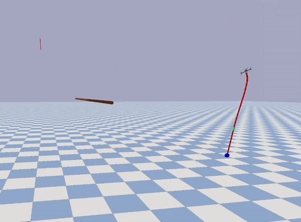

This project introduces a **stable PyBullet simulation environment** designed to simulate the **wrapping of a soft tether**, and to provide a reinforcement learning (RL) setting for a tethered drone to master an **agile** perching **strategy**. The training employs the Soft Actor-Critic from Demonstration (SACfD) technique, with the algorithm implemented using the ['Stable-Baselines3'](https://github.com/DLR-RM/stable-baselines3) library.

A complete tethered drone system (drone-tether-payload) was simulated, incorporating realistic drone dynamics, a PID controller, and a tether-payload system to model the perching process. The drone model used is a MAV model inherited from the ['gym_pybullet_drones'](https://github.com/utiasDSL/gym-pybullet-drones) project, with its compatible PID controller developed by the same team. The simulated MAV has an approximate 1:10 mass ratio, compared to the customized drone used in real-world experiments. 

This project is an initial exploration into building a stable simulation that combines soft tether dynamics, drone dynamics, and a reinforcement learning framework. While initial sim-to-real experiments have been conducted, this methodology remains a preliminary exploration. We recognize there is significant potential for improving the sim-to-real transfer, and we are committed to the ongoing refinement of this work.


<iframe width="560" height="315" src="https://www.youtube.com/watch?v=9JW_PtrSoJ4" title="YouTube video player" frameborder="0" allow="accelerometer; autoplay; clipboard-write; encrypted-media; gyroscope; picture-in-picture; web-share" allowfullscreen></iframe>


## Installation

Tested on Ubuntu 22.04

```
git clone https://github.com/AerialRoboticsGroup/agile-tethered-perching.git
cd gym-pybullet-drones/

conda create -n drones python=3.10
conda activate drones
pip3 install -e . 

export KMP_DUPLICATE_LIB_OK=TRUE 

pip install tensorboard
pip install tqdm rich

pip install tabulate # To run the baseline code
```

## Most Effective Strategy
This strategy was chosen based on an analysis of its smoothness, agility, and control techniques, as well as human observation. Unlike SAC, which aggressively flies over the branch to encourage wrapping, or other SACfD strategies that either exert excessive upward force to tighten the wrapping or make abrupt up-down pitch adjustments to swing the tether, this strategy involves a single upward pitch followed by a quick ascent. It then smoothly switches back to tighten the tether, while also avoiding payload collisions. The whole trajectory balances the agility and smoothness, invovling subtle control technique with deliberate control intention.

| **Normal Speed**                                                                                                                             | **Slow Motion**                                                                                                                             | **Corresponding Simulation**                                                                                                                        |
|-------------------------|--------------------------------------------------------------------------------------------------------------------------------------------|--------------------------------------------------------------------------------------------------------------------------------------------|
|   |                                      |                                                                                       |

                                             
## Future Work
- [ ] Investigate higher-level control strategies, such as velocity-based control, to enhance precision and performance beyond position control.
- [ ] Explore frameworks that directly integrate PyBullet with ROS2 for seamless simulation-to-reality transfer.
- [ ] Incorporate real-world physics elements, like wind and environmental disturbances, into the simulation to enhance realism and robustness.

## References

- Jacopo Panerati and Hehui Zheng and SiQi Zhou and James Xu and Amanda Prorok and Angela P. Schoellig (2021) [*Learning to Fly---a Gym Environment with PyBullet Physics for Reinforcement Learning of Multi-agent Quadcopter Control*](https://arxiv.org/abs/2103.02142) 
- Antonin Raffin, Ashley Hill, Maximilian Ernestus, Adam Gleave, Anssi Kanervisto, and Noah Dormann (2019) [*Stable Baselines3*](https://github.com/DLR-RM/stable-baselines3)
- F. Hauf et al., [*Learning Tethered Perching for Aerial Robots*](https://ieeexplore.ieee.org/document/10161135) 2023 IEEE International Conference on Robotics and Automation (ICRA), London, United Kingdom, 2023, pp. 1298-1304, doi: 10.1109/ICRA48891.2023.10161135.
- Tommy Woodley (2024) [*Agile Trajectory Generation for Tensile Perching with Aerial Robots*](https://github.com/TommyWoodley/TommyWoodleyMEngProject) 
